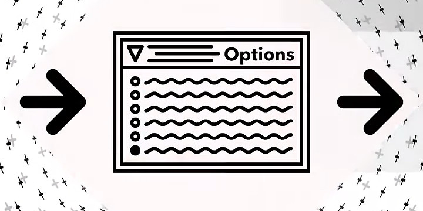

<h1>Hello there!</h1>

My full name *should* be listed on the GitHub profile, but it can be shortened into Bao Nguyen. I started programming at about 2018-19 doing competitive programming, but now I *mostly* do web development (backend) and Linux sysadmin, as well as some *stuff as it interests me*.

For now, my highest profile projects are at [**Arknights VNS**](https://github.com/arknights-vns) for their event (Offline 2025). *(thanks [@ShiinaKochiya](https://github.com/ShiinaKochiya) and [@swyrin](https://github.com/swyrin))*

  

  

    
    
    

<h1>Hobbies and Gaming</h1>

I like to read *Light Novels* (Otonari no Tenshi-sama), cooking and I play *some* games, mostly rhythm games.

If you live in HCMC and frequent *certain* arcades, you may meet me playing `maimai DX` (International ver.). Don't hesitate to call me out and join in if you recgonize me!

<h1>Contact me</h1>

I am mostly active on Discord (`@giabao06`). Should you need to formally contact me for non-job related matters, you can [email me](mailto:hello@giabao06.xyz).

---

    
     
    <a href="https://www.youtube.com/watch?v=knXGYSdtr_k"><i>Information alone is not enough, We also meed the meaning of that information.</i></a>
     
    <i>- Options</i>

